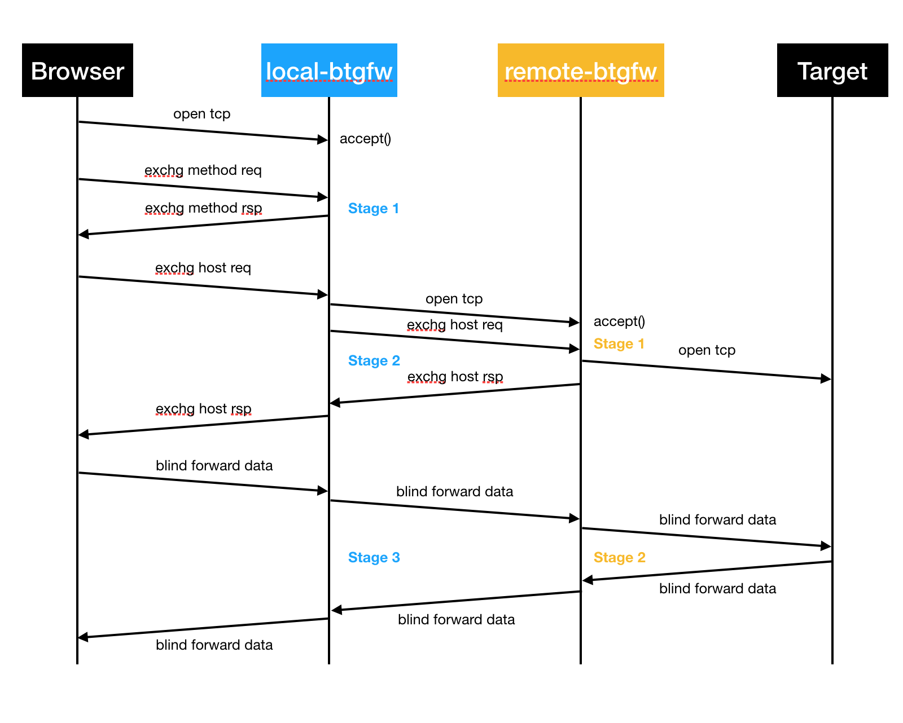

# btgfw
Break Through GFW

Btgfw is socks5 proxy, it consists of local-btgfw and remote-btgfw. local-btgfw runs on the local computer, remote-btgfw runs on the remote computer.

## How does it works

## Dependency
- libssl-dev

### Dependency installation
- Ubuntu
  - `sudo apt install libssl-dev`
- macOS
  - `brew install openssl`

## Build from source
1. git clone https://github.com/lampmanyao/btgfw.git
2. cd src
3. make

## System socks5 proxy setup
### Mac
- start: `networksetup -setsocksfirewallproxy Wi-Fi localhost 1080`
- stop: `networksetup -setsocksfirewallproxystate Wi-Fi off`
- status: `networksetup -getsocksfirewallproxy Wi-Fi`

## TODOs
- support proxy auto-config
- support more cipher-suites
- support DNS cache
- support IPv6
- support UDP
